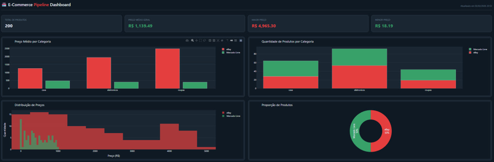

Markdown# Cross-API E-Commerce Sales Pipeline


**Comparação inteligente de preços e métricas entre eBay e Mercado Livre**

Projeto completo de Engenharia de Dados que coleta, transforma e analisa dados de produtos de dois grandes marketplaces, entregando um dashboard interativo com KPIs claros e visualizações comparativas.

## 🎯 Objetivo do Projeto

Construir um pipeline ETL orquestrado que:
- Coleta dados de produtos de eBay e Mercado Livre via API mock
- Limpa e enriquece os dados (tratamento de nulos, preços inválidos, duplicatas, conversão USD → BRL)
- Armazena com upserts no PostgreSQL
- Gera dashboard analítico completo com Plotly
- Executa diariamente via Apache Airflow

## ✨ Features Principais

- Ingestão robusta com healthchecks e retries
- Tratamento intencional de dados sujos (20% nulos, preços inválidos, duplicatas)
- Upserts idempotentes (ON CONFLICT DO UPDATE)
- Dashboard rico com KPIs executivos:
  - Total de produtos
  - Preço médio geral
  - Maior / Menor preço
  - Preço médio por categoria (comparativo)
  - Quantidade por categoria
  - Distribuição de preços (histograma)
  - Proporção eBay × Mercado Livre (pie chart)
- Containerização completa com Docker Compose
- Healthchecks em todos os serviços
- Variáveis de ambiente seguras

## 🛠 Tech Stack

- **Orquestração**: Apache Airflow 2.9.2 (LocalExecutor)
- **Banco de Dados**: PostgreSQL 16
- **API Mock**: Flask + Faker('en_US') + faker-commerce
- **Processamento**: Pandas + SQLAlchemy
- **Visualização**: Plotly Express
- **Containerização**: Docker + Docker Compose
- **Dependências**: psycopg2-binary, SQLAlchemy, plotly

## 📊 Dashboard (Exemplo)



## 🚀 Como Executar

### Pré-requisitos
- Docker Desktop + Docker Compose
- Git

### Passo a passo
```bash
# 1. Clone o repositório
git clone https://github.com/seuusuario/cross-api-ecommerce-pipeline.git
cd cross-api-ecommerce-pipeline

# 2. Gere uma Fernet key (obrigatório)
python -c "from cryptography.fernet import Fernet; print(Fernet.generate_key().decode())"

# 3. Copie e preencha o .env (não commitado)
cp .env.example .env
# Cole a Fernet key gerada no AIRFLOW__CORE__FERNET_KEY

# 4. Suba o ambiente
docker-compose down -v
docker-compose build
docker-compose up -d


# 5. Acesse
Airflow UI → http://localhost:8080 (admin / admin)
Mock API    → http://localhost:5000/health
Postgres    → localhost:5432

```

Executar o Pipeline

Na UI do Airflow → Ative a DAG ecommerce_pipeline
Clique em "Trigger DAG" (manual) ou aguarde o schedule (@daily)
Dashboard gerado em /app/dashboard.html (monte volume ou copie do container)
```bash

docker cp airflow:/opt/airflow/dashboard.html ./dashboard.html
```
Após isso, basta abrir o dashboard gerado

## 📁 Estrutura do Projeto
```bash

text├── dags/
│   └── ecommerce_dag.py          # DAG principal
├── etl.py                        # Pipeline completo (ETL + dashboard)
├── mock_api.py                   # API mock Flask + Faker
├── Dockerfile                    # Imagem do mock-api
├── Dockerfile.airflow            # Extensão customizada do Airflow
├── entrypoint.sh                 # Inicialização idempotente do Airflow
├── init.sql                      # Criação dos bancos airflow_db + ecommerce_db
├── docker-compose.yml
├── requirements.txt
└── README.md
```

🔧 Arquitetura
```bash

Mercado Livre API Mock ─┐
                        │→ Extract (requests) → Transform (Pandas) → Load (SQLAlchemy + ON CONFLICT)
eBay API Mock ──────────┘
                        ↓
                 PostgreSQL (Bronze → Silver → Gold via views)
                        ↓
                 Plotly Dashboard (HTML interativo)
                        ↑
                 Apache Airflow (orquestração + scheduling)
```

🚀 Próximos Passos (Roadmap)

 Integração com APIs reais (eBay Browse API + Mercado Livre Items API)
 Real-time stream com Kafka + Spark Streaming
 Camadas Silver/Gold
 Testes unitários + Great Expectations para data quality

📄 Licença
MIT License